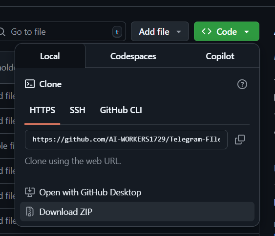

## Telegram Video Downloader Pro
### Clone the Repo 🚀

1. **Create a new directory for the project:**
    ```bash
    mkdir TeleDownloaderPro
    ```

2. **Navigate into the directory:**
    ```bash
    cd TeleDownloaderPro
    ```

3. **Clone the repository:**
    ```bash
    git clone https://github.com/AI-WORKERS1729/Telegram-FIle-Downloader-Pro.git .
    ```

---

### ⚠️ Having Trouble Cloning? Try These Alternatives:

#### 1. **Download as ZIP 📦**
If cloning doesn't work, you can download the repository as a ZIP file from GitHub.  
Click the green **"Code"** button and select **"Download ZIP"**.  


#### 2. **Install Git CLI 🛠️**

- **Windows:**  
  Download and install Git from [git-scm.com](https://git-scm.com/download/win).

- **macOS:**  
  Install Git using Homebrew:
  ```bash
  brew install git
  ```
  Or download from [git-scm.com](https://git-scm.com/download/mac).

- **Linux:**  
  Install Git using your package manager:
  ```bash
  sudo apt update
  sudo apt install git
  ```

After installation, verify Git is installed:
```bash
git --version
```
You should see the installed Git version. 🎉

---

### Edit the `.env.example` File 📝

1. **Rename** `.env.example` to `.env`.
2. **Open** the `.env` file and enter your actual Telegram `API_ID` and `API_HASH`.

For details on how to get these values, see below. 👇

### How to Get `API_ID` and `API_HASH` 🔑

1. **Go to the [Telegram API Development Tools](https://my.telegram.org/auth) website.** 🌐

2. **Log in with your Telegram account.**  
    Enter your phone number and verify with the code sent to your Telegram app. 📱

3. **Click on "API development tools".** 🛠️

4. **Fill in the required fields:**
    - **App title:** Choose any name for your app (e.g., `TeleDownloaderPro`).
    - **Short name:** Enter a short identifier (e.g., `tdpro`).
    - **URL:** You can leave this blank or enter your project URL.

5. **Submit the form.** 🚀

6. **Copy your `API_ID` and `API_HASH` from the generated values.**  
    Paste them into your `.env` file.

> ⚠️ **Keep your `API_HASH` secret!** Never share it publicly.

You're now ready to use the bot! 🎉

### Install requirements:
```bash
pip install -r requirements.txt
```

### Run `main.py`:
```bash
python main.py
```
Wallah! Enjoy....